<h1 align="center">Hi 👋, I'm Nuri Onacak</h1>
<h3 align="center">A passionate game developer from Türkiye</h3>

  

- 🔭 I’m currently working on [Funverse Games](https://www.funversegames.com/)

- 🌱 I’m currently learning **Unreal Engine 5 C++**

- 📫 How to reach me **nuri.onacak@hotmail.com**

- 📎 My website-Portfolio [nurionacak.dev](https://www.nurionacak.dev/)

- ⚡ **My projects are developed with love and caffeine.**

<h3 align="left">Connect with me:</h3>

<h3 align="left">Languages and Tools:</h3>

       

&nbsp;

